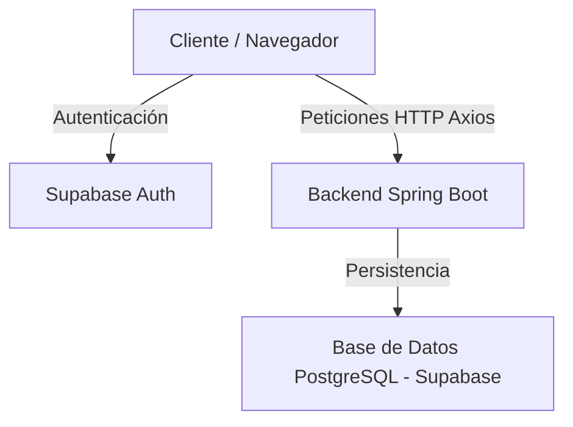

# Análisis Técnico del Proyecto PEMS — Kiki y Lala

Este documento provee un inventario y análisis exhaustivo de la arquitectura, tecnologías, flujos, base de datos y problemas críticos detectados en el proyecto **PEMS (Kiki y Lala)**.

---

## 1. Arquitectura General y Tecnologías

El sistema sigue una arquitectura de **Frontend Desacoplado** que se comunica mediante solicitudes HTTP (REST JSON) con un **Backend de Servicios** y consume la autenticación de **Supabase**.



### Tecnologías Usadas

- **Core**: Next.js v16.2.4 (App Router) y React v18.3.1.
- **Lenguaje**: TypeScript v5.9.2 (en modo estricto).
- **Estilos y UI**: Tailwind CSS v3.4.17, componentes base de Shadcn UI v4.7.0, Radix UI para componentes accesibles, y Lucide React para iconografía.
- **Manejo de Estado**:
  - **Estado Global Local**: Zustand v5.0.8 (8 stores dedicados).
  - **Estado del Servidor (Cache & Fetching)**: TanStack React Query v5.90.5.
- **Cliente HTTP**: Axios v1.12.2 (con interceptores centralizados para inyección de token Bearer y control de expiración de sesión).
- **Formularios y Validación**: React Hook Form v7.62.0 con resolvers de Zod v4.1.5.
- **Utilitarios**: Date-fns v4.1.0 para manejo de fechas y JSQR v1.4.0 para el escaneo de entradas mediante código QR.

---

## 2. Estructura de Carpetas

El proyecto está organizado en base a una estructura limpia de Next.js App Router dentro de `src/`:

```text
src/
├── app/                    # Capa de Enrutamiento y Páginas (App Router)
│   ├── (public)/          # Rutas públicas (Landing, Reservas públicas, FAQ, Nosotros)
│   ├── (wizard)/          # Flujos paso a paso de reserva (Wizard de Celebraciones)
│   ├── admin/             # Módulo administrativo protegido (Dashboard, Finanzas, Ventas)
│   ├── auth/              # Páginas de Login, Registro, Recuperación de Contraseña
│   ├── cliente/           # Panel privado para el cliente autenticado
│   ├── api/               # API Routes locales de Next.js (stubs vacíos de testing/auth)
│   ├── layout.tsx         # Layout raíz e inyección de Fonts/CSS
│   └── providers.tsx      # Contenedor de Providers globales de la app
├── components/            # Componentes reutilizables de React (152 archivos)
│   ├── admin/             # Componentes específicos de administración (18 subcarpetas)
│   ├── brand/             # Logotipo y branding del negocio
│   ├── public/ / cliente/ # Componentes para vistas públicas y de clientes
│   ├── common/            # Componentes reutilizables generales (DataTable, uploader, etc.)
│   └── ui/                # Componentes básicos de Shadcn UI (botones, inputs, select, etc.)
├── config/                # Constantes globales, menús de navegación y permisos de rol
├── features/              # Feature modules (actualmente vacíos)
├── hooks/                 # 30 hooks personalizados (React Query, preferencias, tema)
├── lib/                   # Configuraciones core (Supabase, Axios, Zustand stores, esquemas Zod)
├── services/              # Capa de consumo de API (25 servicios REST)
├── types/                 # Definiciones de tipos e interfaces TypeScript (24 archivos)
└── utils/                 # Funciones helper transversales
```

---

## 3. Integración Frontend y Backend

El proyecto es el **Frontend** de la aplicación.

- **Backend**: Existe un backend independiente basado en **Spring Boot** (Java) que expone servicios REST a través de la URL de configuración `NEXT_PUBLIC_API_URL` (por defecto `http://localhost:8080/api/v1`).
- **Autenticación**: Supabase actúa como el proveedor de identidad. El frontend valida el inicio de sesión contra la API de Supabase, obtiene el JWT, e inyecta este token en la cabecera `Authorization: Bearer <JWT>` de todas las solicitudes Axios dirigidas al backend Spring Boot.
- **Consumo de datos**: El backend valida el JWT de Supabase y responde con objetos/listas mapeados directamente en los tipos de TypeScript en el frontend.

---

## 4. Flujos Principales de la Aplicación

1.  **Flujo de Autenticación y Autorización**:
    - Inicio de sesión con Supabase Auth -> Obtención del JWT.
    - Llamada inmediata a `/health/me` en Spring Boot usando el JWT para resolver los roles, permisos, perfil del cliente, y sede asignada del usuario.
    - Persistencia de datos del perfil en Zustand (`useAuthStore`) y almacenamiento del tipo de perfil en la cookie `x-tipo-perfil`.
    - Redirección automática: Staff -> `/admin/dashboard` | Clientes -> `/cliente`.
2.  **Wizard de Solicitud de Celebración (Eventos Privados)**:
    - Flujo multipaso `/celebraciones/solicitar` donde el usuario selecciona sede, paquete, turnos disponibles, servicios de cotización adicionales y extras libres.
    - Estado temporal persistido en `borrador.store.ts` de Zustand.
    - Creación de evento en estado `SOLICITADA`.
    - Gestión por el administrador: Confirmación, fijación de tarifas, registro de adelantos y cambio de estado a `CONFIRMADA`.
3.  **Flujo de Venta Presencial (POS)**:
    - El cajero crea ventas presenciales en `/admin/ventas/nueva` agregando tickets y productos.
    - Gestión del carrito en tiempo real mediante Zustand `cart.store.ts`.
    - Registro del pago (efectivo, Yape, transferencia) y generación del ticket con código QR.
4.  **Validación de Ingreso en Puerta**:
    - El cliente presenta el QR de sus entradas desde su móvil (`/cliente/mis-entradas`).
    - El staff en la entrada (`/admin/accesos/entradas`) escanea el QR usando la cámara del dispositivo (`jsqr`).
    - Validación inmediata llamando al backend (`POST /reservas/{id}/ingreso`).

---

## 5. Base de Datos y Mapeo de Modelos

La base de datos relacional (PostgreSQL en Supabase) es gestionada por el backend Spring Boot. Los modelos principales mapeados en el frontend son:

- **Reserva** (`src/types/reserva.types.ts`): Representa el acceso individual a las zonas de juego (tickets). Controla aforo, acompañantes, firma de consentimiento de seguridad y reprogramación de visitas.
- **Evento Privado** (`src/types/evento.types.ts`): Cumpleaños, fiestas y celebraciones con paquetes configurados, aforo específico, turnos preestablecidos y listas de tareas operativas (Checklist).
- **Cliente** (`src/types/cliente.types.ts`): Registro unificado de usuarios (VIP, regular, corporativo) con acumulación de visitas, volumen de consumo financiero e historial de contacto.
- **Finanzas** (`src/types/finanzas.types.ts`): Control de cajas (apertura, movimientos manuales/automáticos y cierres diarios) y presupuestos de eventos (gastos operativos vs utilidad).

---

## 6. Puntos Débiles y Problemas Críticos

### A. Middleware de Next.js Inoperante (Gravedad: CRÍTICO)

El archivo que debería encargarse de proteger las rutas `/admin` y `/cliente` en Next.js está mal nombrado como `proxy.ts` (`src/proxy.ts`).

- **Problema**: Next.js **ignora** cualquier archivo de middleware que no se llame literalmente `middleware.ts` en la raíz de `src/`. Adicionalmente, exporta una función llamada `proxy` en lugar del standard default `middleware`.
- **Impacto**: Las rutas administrativas y de clientes **no tienen protección real a nivel Edge**, exponiendo la UI privada si el usuario digita la URL directamente (aunque las peticiones REST fallen por falta de token).

### B. Incompatibilidad de Tipos de Datos (Gravedad: CRÍTICO)

Hay desalineaciones severas entre los tipos declarados en TypeScript y los tipos de datos reales devueltos por el backend Spring Boot tras la migración a Supabase:

1.  **AperturaCaja (`idUsuarioApertura` / `idUsuarioCierre`)**: Definidos como `number` en TS, pero devueltos como `UUID` (string) por el backend. Esto causa que falle el renderizado o las validaciones en operaciones de caja.
2.  **Campaña de Email (`idUsuarioCreador`)**: El frontend espera un `number` llamado `idUsuarioCreador`, pero el backend devuelve un `UUID` en un campo llamado `createdBy`.
3.  **ContenidoWeb (`idSeccion` / `idTipoContenido`)**: El frontend los declara como `number`, pero el backend utiliza códigos alfanuméricos (`String`).
4.  **SecciónWeb (`id`) y Configuración Pública (`id`)**: En el frontend son numéricos obligatorios, pero en el backend no existen (las secciones usan el código como PK, y la configuración pública es un singleton sin ID).

### C. Nombre de Variables Incorrecto (Gravedad: ALTO)

El backend devuelve propiedades con nombres que difieren del frontend, lo que causa valores `undefined` silenciosos en la UI:

- `SeccionWeb.ordenVisualizacion` en frontend vs `orden` en backend.
- `ConfiguracionPublica.logoUrl` vs `logoPath` en backend.
- `ConfiguracionPublica.faviconUrl` vs `faviconPath` en backend.
- `ConfiguracionPublica.openGraphImageUrl` vs `openGraphImagePath` en backend.
- `ConfiguracionPublica.horarioFinDeSemana` vs `horarioFinSemana` en backend.
- `ConfiguracionPublica.mantenimientoActivo` vs `esMantenimientoActivo` en backend.

### D. Componentes Monolíticos (Gravedad: MEDIO - Mantenibilidad)

Existen varias páginas que exceden las 800 líneas de código y acoplan demasiada lógica de maquetado, control de estado y fetching:

- `mi-cuenta/page.tsx` (1,170 líneas): Administra datos personales, fiscales, cambio de contraseña e historial en un solo archivo.
- `promociones/page.tsx` (1,013 líneas): Mezcla tablas de visualización con formularios de creación y edición.
- `solicitar/page.tsx` (930 líneas): Combina la lógica de todos los pasos del wizard de reserva.

### E. Código Muerto y Stubs Vacíos (Gravedad: BAJO)

- Existen servicios sin implementar con contenido vacío: `auditoria.service.ts` y `usuario-admin.service.ts`.
- El directorio `src/features` contiene 8 subdirectorios que son carpetas con archivos vacíos.
